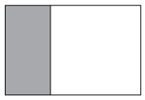
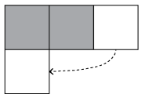
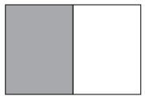
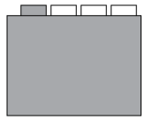
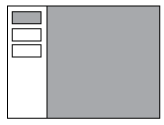
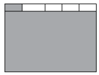
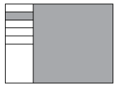

# Single view pages

## sidebarLayout

 

This is the layout we've been using so far in this workshop. We always used a `sidebarPanel()` for our UI input elements and and `mainPanel()` for out output elements, but actually you can put things where you like.

```
ui <- fluidPage(
        sidebarLayout(
          sidebarPanel(),
          mainPanel())
        )
```

## fluidRow

 

A more basic layout just splits the web-page into twelve columns. the `fluidRow()` specifies a row field and the `column()` function specifies how many of the 12 units to use. The offset artument shifts that region to the right.

```
ui <- fluidPage(
        fluidRow(column(width = 4),
                 column(width = 2, offset = 3)),
        fluidRow(column(width = 12))
        )
```

## flowLayout

 

This layout allows elements to move according to the screen size.

```
ui <- fluidPage(
        flowLayout(# object 1,
                   # object 2,
                   # object 3)
        )
```


## splitLayout

 

This produces a horizontal arrangement of elements.

```
ui <- fluidPage(
        splitLayout(# object 1,
                    # object 2)
        )
```

## verticalLayout

 

This produces a vertical arrangement of elements.


```
ui <- fluidPage(
        verticalLayout(# object 1,
                       # object 2,
                       # object 3)
        )
```


# Layered Tab Panels

All of the options below provide ways of producing multiple pages which are access via some kind of tabbed system, inclusing pull-down menu items.

## tabsetPanel

 

This is the classic tabbed web-page layout

```
ui <- fluidPage(
        tabsetPanel(
          tabPanel("tab 1", "contents"),
          tabPanel("tab 2", "contents"),
          tabPanel("tab 3", "contents")))
```

## navlistPanel

 

Here, the tabs appear on the left side of the page in a sidebar window.

```
ui <- fluidPage(
        navlistPanel(
          tabPanel("tab 1", "contents"),
          tabPanel("tab 2", "contents"),
          tabPanel("tab 3", "contents")))
```

## navbarPage

 

Instead of proper tabs, this produces a navigation bar at the top of the page

```
ui <- navbarPage(title = "Page",
        tabPanel("tab 1", "contents"),
        tabPanel("tab 2", "contents"),
        tabPanel("tab 3", "contents"))
```

## Dashboards

 

This is a classic dashboard type web-design. Within the main body, you can arrange elements are you like using the flat page layouts above. Install and load the `shinydashboard` package to use.

```
library(shinydashboard)

dashboardPage(
  dashboardHeader(),
  dashboardSidebar(),
  dashboardBody()
)
```

See https://rstudio.github.io/shinydashboard/ for details on advanced functions
