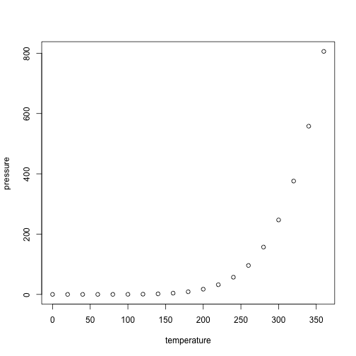

## R Markdown

This is an R Markdown document. Markdown is a simple formatting syntax for authoring HTML, PDF, and MS Word documents. For more details on using R Markdown see <http://rmarkdown.rstudio.com>.

When you click the **Knit** button a document will be generated that includes both content as well as the output of any embedded R code chunks within the document. You can embed an R code chunk like this:


```r
library(shiny)

inputPanel(
  actionButton("action", label = "Action"))
```

<!--html_preserve--><div class="shiny-input-panel">
<div class="shiny-flow-layout">
<div>
<button id="action" type="button" class="btn btn-default action-button">Action</button>
</div>
</div>
</div><!--/html_preserve-->

Produces

<!--html_preserve--><pre id="out6c4ac4ad3f503688" class="shiny-text-output noplaceholder"></pre><!--/html_preserve-->

## Including Plots

You can also embed plots, for example:



Note that the `echo = FALSE` parameter was added to the code chunk to prevent printing of the R code that generated the plot.
