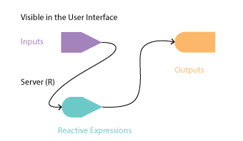

## Part 1: input and output objects

We already saw how each UI widget adds a named element to an internal list called `input`.

The next step is to realise that we can capture the output of each `render*()` function in another internal list, called `output`. For example:

```
output$plot <- renderPlot({
  # plotting functions here
})
```

This allow us to use the output where ever we like.

## Part 2: The ui and the server

No we have all the compoments to assemble our input, output and reactive expressions in a cohesive interactive application. For this, we'll create two objects:

1. `ui` will contain all of our input and output which is visible to the user, 
2. `server` will be a function that executes all the reactive expressions and 

We can do this all in a single document and execute our functions using:

- `shinyApp(ui, server)`


 


The relationship between these items is as such:
 



## Part 3: Calcualte output with `render*()` and display with `*Output()`

We saw in the last sections that `render*()` functions build output to display in the app UI. These are reactive expressions that respond every time a reactive value (i.e. an `input$...`) changes.

When one of its reactive expressions becomes invalid, the object created by a `render*()` function **will rerun the entire block of code** associated with it.

Each `render*()` function is associated with one or more `*Output()` functions that can be placed anywhere in the UI. To display the output, we just need to call the named element in the `output` list object, exactly like how we access each user input by calling a named element in the `input` list object.

<style type="text/css">
.tg  {border-collapse:collapse;border-spacing:0;border-color:#ccc;}
.tg td{font-family:Arial, sans-serif;font-size:14px;padding:10px 5px;border-style:solid;border-width:0px;overflow:hidden;word-break:normal;border-color:#ccc;color:#333;background-color:#fff;}
.tg th{font-family:Arial, sans-serif;font-size:14px;font-weight:normal;padding:10px 5px;border-style:solid;border-width:0px;overflow:hidden;word-break:normal;border-color:#ccc;color:#333;background-color:#f0f0f0;}
.tg .tg-n1xd{background-color:#efefef;color:#333333;vertical-align:top}
.tg .tg-yzt1{background-color:#efefef;vertical-align:top}
.tg .tg-9hbo{font-weight:bold;vertical-align:top}
.tg .tg-yw4l{vertical-align:top}
</style>
<table class="tg">
  <tr>
    <th class="tg-9hbo">Desired Item</th>
    <th class="tg-9hbo">Render Function<br>(on server side)</th>
    <th class="tg-9hbo">Output Function<br>(on UI Side)</th>
  </tr>
  <tr>
    <td class="tg-yw4l">Plot</td>
    <td class="tg-yw4l">renderPlot()</td>
    <td class="tg-yw4l">plotOutput()</td>
  </tr>
  <tr>
    <td class="tg-n1xd">Text</td>
    <td class="tg-n1xd">renderText()</td>
    <td class="tg-n1xd">textOutput()</td>
  </tr>
  <tr>
    <td class="tg-yw4l">Formatted table</td>
    <td class="tg-yw4l">renderTable()</td>
    <td class="tg-yw4l">tableOutput()</td>
  </tr>
  <tr>
    <td class="tg-yw4l"></td>
    <td class="tg-yw4l">DT::renderDataTable()</td>
    <td class="tg-yw4l">dataTableOutput()</td>
  </tr>
  <tr>
    <td class="tg-yzt1">Console text</td>
    <td class="tg-yzt1">renderPrint()</td>
    <td class="tg-yzt1">verbatimTextOutput()</td>
  </tr>
  <tr>
    <td class="tg-yw4l">Generate UI Elements</td>
    <td class="tg-yw4l">renderUI()</td>
    <td class="tg-yw4l">uiOutput()</td>
  </tr>
  <tr>
    <td class="tg-yw4l"></td>
    <td class="tg-yw4l">renderImage()</td>
    <td class="tg-yw4l">imageOutput()</td>
  </tr>
</table>

## Part 4: Putting it all together

The minimum structure we have for a shiny app is:

```
library(shiny)

ui <- fluidPage(
sidebarLayout(
    sidebarPanel(
      #####
      ##### UI components here
      #####
    ),
    mainPanel(
      #####
      ##### Output components here
      #####
    )
)

server <- function(input, output) {
      #####
      ##### Reactive components here
      #####
  
    output$plot <- renderPlot({
      #####
      ##### Plotting functions here
      #####
    })
}

shinyApp(ui, server)
```

When using a single file for all your shiny app code, call is `app.R`.

These are the non-input, non-output functions in the `ui`.

```
fluidPage(
  sidebarLayout(
    sidebarPanel(),
    mainPanel()
  )
)
```

To make clear what they are doing, when we execute them alone, we get this:

```
<div class="container-fluid">
  <div class="row">
    <div class="col-sm-4">
      <form class="well"></form>
    </div>
    <div class="col-sm-8"></div>
  </div>
</div>
```

They simply produce the structure of a website that we can populate when we execute shiny commands:
